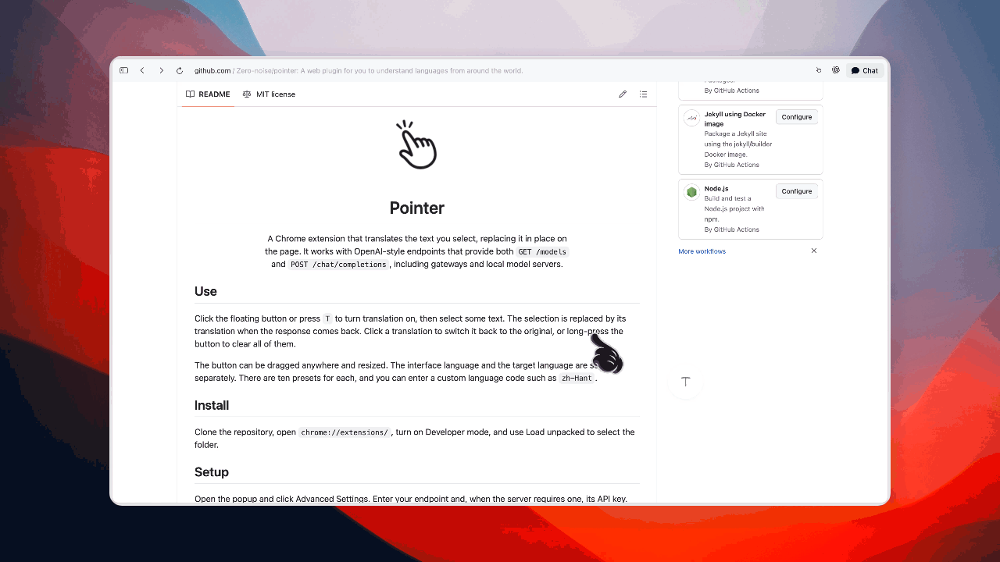

  

  <h1>Pointer</h1>

  

    A Chrome extension that translates the text you select, replacing it in place on 
    the page. It works with OpenAI-style endpoints that provide both <code>GET /models</code> 
    and <code>POST /chat/completions</code>, including gateways and local model servers.
  

  

## Use

Click the floating button or press `T` to turn translation on, then select some
text. The selection is replaced by its translation when the response comes
back. Click a translation to switch it back to the original, or long-press the
button to clear all of them.

The button can be dragged anywhere and resized. The interface language and the
target language are set separately. There are ten presets for each, and you can
enter a custom language code such as `zh-Hant`.

## Install

Clone the repository, open `chrome://extensions/`, turn on Developer mode, and
use Load unpacked to select the folder.

## Setup

Open the popup and click Advanced Settings. Enter your endpoint and, when the
server requires one, its API key. Click Verify to load the model list, then
choose a model.

Verify checks that the endpoint responds and binds the key to it. Chrome is only
asked for permission on that scheme, host, and port. If you change the address,
permission for the previous address is removed. The key is kept in
`chrome.storage.local`, so it stays on this device and is not synced.

### Local and LAN servers

You can leave the key blank for a server on localhost or a private LAN. For a
non-loopback private HTTP server, Pointer does not send a configured key by
default; when that server requires authentication, Settings shows a LAN
authentication switch for that exact server and key. HTTP is allowed for
loopback and for literal private addresses (`10.0.0.0/8`, `172.16.0.0/12`,
`192.168.0.0/16`, and `fc00::/7`). Public IPs and hostnames like `nas.local`
still need HTTPS.

Note that HTTP over a LAN is unencrypted, so anyone on that network can read or
change what you send. Only use it on a network you trust.

## Shortcut

The default shortcut is `T`. To change it, click the shortcut in Settings and
press a new key; hold Alt/Option while binding if you want to require that
modifier. Pointer avoids triggering the shortcut while you are typing or using
keyboard-driven controls. If a bare key repeatedly conflicts with a site,
Pointer switches that site to Alt/Option + key and lists the exception in
Settings.

## Privacy

Pointer has no analytics, telemetry, or server of its own. It sends selected
text, the target-language instruction, the chosen model, and, when the endpoint
policy allows it, the configured API key directly to the endpoint verified in
Settings. The API key is stored locally. Pointer runs on webpages to handle
selections and requests network access only for the endpoint chosen when you
click Verify.

## Development

`./package.sh` runs the automated tests and builds
`dist/pointer-<version>.zip`.

Implementation references: [visual system](docs/FAB_UI_DESIGN.md),
[selection behavior](docs/SELECTION_CASES.md), and
[manual regression](docs/MANUAL_REGRESSION.md).

## License

MIT.
